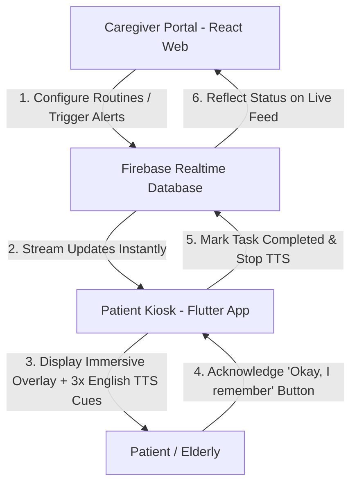

# Remember.For.Me: Ambient Dementia Care Ecosystem (MVP)

**Remember.For.Me** is a professional Ambient Dementia Care Ecosystem designed to assist elderly individuals with cognitive decline (such as Alzheimer's or dementia) in maintaining safe daily routines at home. The system bridges remote caregiving and home ambient assistance using a real-time, cross-platform architecture.

The project consists of two core components:
1. **Caregiver Portal (`/caregiver`)**: A modern web dashboard for family members and caregivers to configure daily schedules, track vitals, monitor Bluetooth tags, and trigger manual reminders. Built with **React + Vite + Tailwind CSS**.
2. **Patient Kiosk (`/kiosk_app`)**: An ambient, high-legibility home screen for the elderly. Built with **Flutter**, it supports multi-platform deployment (**Android Tablets/TVs**, **Chrome Web**, and **Windows**) and features English Text-to-Speech (TTS) auditory cues.

---

## 🛠️ System Architecture & Demo Flow



---

## 📂 Repository Structure

Below is the detailed project file layout, showcasing the structured organization of both codebases:

```text
REMEMBER.FOR.ME/
├── caregiver/                 # Caregiver Web Dashboard (React)
│   ├── package.json           # Node dependencies and build scripts
│   ├── vite.config.ts         # Vite server configuration (Port 8080)
│   ├── tailwind.config.js     # Tailwind CSS design system utility classes
│   └── src/
│       ├── App.tsx            # Main state controller and Firebase bindings
│       ├── firebase.ts        # Firebase Auth & Realtime Database connection
│       ├── index.css          # Global styling tokens & custom animations
│       └── main.tsx           # React bootstrap entrypoint
│
├── kiosk_app/                 # Ambient Home Kiosk Application (Flutter)
│   ├── pubspec.yaml           # Flutter packages (TTS, Blue Plus, Google Fonts)
│   ├── android/               # Native Android configurations (with Gradle support)
│   ├── web/                   # Web build configuration for Smart TV browsers
│   ├── windows/               # Native Windows build configuration
│   └── lib/
│       ├── main.dart          # App initialization & global theme setup
│       ├── firebase_options.dart # Multi-platform Firebase credentials
│       ├── models/
│       │   └── task.dart      # Task & DayPart data models (Morning/Afternoon/Evening)
│       ├── theme/
│       │   └── app_colors.dart # Cozy warm cream palette inspired by Hân's design
│       ├── services/
│       │   └── kiosk_sync.dart # Realtime Firebase sync, BLE scan loops, & simulated vitals
│       ├── screens/
│       │   ├── kiosk_home.dart # Kiosk shell containing navigation, top-bar, & TTS loop
│       │   ├── alert_overlay.dart # Animated twilight blue announcement screen with sound waves
│       │   └── debug_panel.dart # Simulation panel for mocking GPS geofencing & vitals
│       ├── tabs/
│       │   ├── home_tab.dart  # Two-column view: Clock/Reassurance vs. Today's Routine
│       │   ├── reminders_tab.dart # Grouped schedule timeline matching current period
│       │   └── health_tab.dart # Health metrics monitoring card (Heart Rate, Location)
│       └── widgets/
│           └── reminder_card.dart # Reusable UI widgets for routine timeline items
│
├── docs/                      # Technical database references
│   └── firebase_schema.json   # Mock schema definition for the Realtime Database
│
├── PROJECT_SUMMARY.md         # In-depth architectural analysis and file descriptions
├── DEVELOPER_ONBOARDING.md    # Step-by-step environment setup guide for new developers
└── kiosk-app-release.apk      # Compiled standalone Android release package
```

---

## ⚡ Key Features

*   **Real-time Synchronization**: Instant data binding between caregiver Web Portal and home tablet Kiosk via Firebase RTDB.
*   **Warm Cream High-Legibility UI**: Soft cream background (`#F9F6F0`) and high-contrast typography designed specifically to reduce glare and visual fatigue for elderly users.
*   **Triple Auditory Cueing (TTS)**: When a reminder is activated, an English voice reads the description aloud **3 times** at a steady rate, ensuring clarity.
*   **Audio Announcement Overlay**: Fullscreen deep twilight blue card showing custom pulse ripples representing sound waves. Bypasses TV/tablet standby modes.
*   **Wandering Protection (BLE Tracker)**: Monitors proximity to Bluetooth Smart Tags to automatically detect if the patient leaves the house, updating status to `Away` and sending warning notifications to caregivers.
*   **Simulated Vitals**: Heartbeat transmission every 10 seconds and heart-rate fluctuations to keep caregivers informed of the tablet's connectivity status.
*   **Hardware Exit Blocker**: Uses Flutter `PopScope` to disable back gesture/button, and supports Android's native App Pinning for a 24/7 dedicated device mode.

---

## 🚀 Quick Start Guide

### 1. Launch the Caregiver Portal
Ensure you have [Node.js](https://nodejs.org/) installed, then run:
```bash
cd caregiver
npm install
npm run dev
```
👉 Access the Web Dashboard at: **[http://localhost:8080](http://localhost:8080)**.

### 2. Launch the Patient Kiosk (Flutter)
Ensure you have the [Flutter SDK](https://flutter.dev/) installed, then run:
```bash
cd kiosk_app
flutter pub get
# Run in Google Chrome (Highly recommended for testing/debugging)
flutter run -d chrome
# Run as a native Windows Desktop application
flutter run -d windows
```
*(For physical TV or Android tablet deployments, install the compiled **`kiosk-app-release.apk`** found at the root of the project).*

---

## 🔒 Firebase Realtime Database Paths

The ecosystem communicates through a default mock profile path `families/family_001`. Key nodes:
*   `elder`: Stores patient name, current zone status (`in_home` / `out_of_home`), and timestamp.
*   `tasks`: List of daily schedules containing `scheduled_time`, `is_auto`, `status`, and `is_triggered`.
*   `emergency`: Triggers fullscreen red flashing alert for incoming calls or urgent help.
*   `kiosk`: Health heartbeats from the tablet to monitor network connection (`online` / `lastHeartbeatAt`).
*   `ble`: Configures UUIDs and parameters for physical Bluetooth proximity scanning.

---

## 📖 Additional Project Documentation

For more in-depth development guides and technical overviews:
*   **[PROJECT_SUMMARY.md](file:///c:/Users/LENOVO/Downloads/REMEMBERFORME/REMEMBER.FOR.ME/REMEMBER.FOR.ME/PROJECT_SUMMARY.md)**: Deep dive into core codebase logic, packages, and database sync.
*   **[DEVELOPER_ONBOARDING.md](file:///c:/Users/LENOVO/Downloads/REMEMBERFORME/REMEMBER.FOR.ME/REMEMBER.FOR.ME/DEVELOPER_ONBOARDING.md)**: Setup guide for cloning, database configuration, and deployment.
